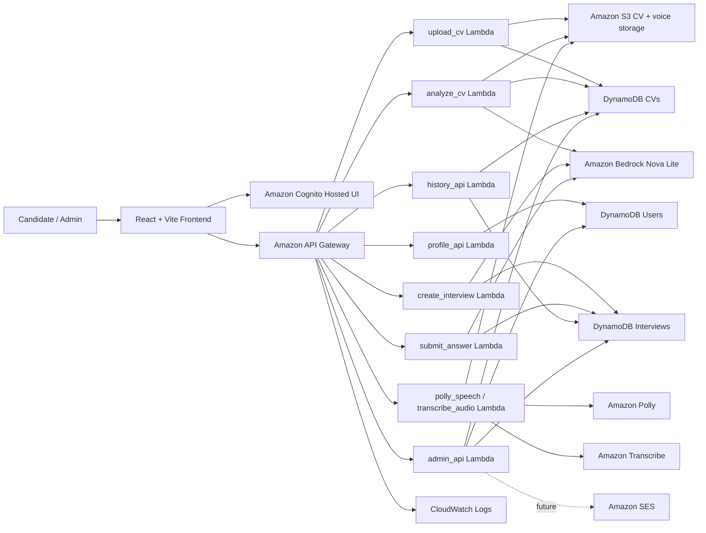

# Vertex-IntervAI 
## An AWS Serverless AI Interview Platform

### 1. Executive Summary

Vertex-IntervAI, is a web application that helps candidates prepare for interviews from their own CV. A user uploads a CV, the system stores it securely, analyzes it with AI, creates interview questions based on the CV and selected role, accepts typed or voice answers, evaluates each answer, and returns a result with scores, feedback, and improvement advice.

The project uses a React + Vite frontend and an AWS Serverless backend. The backend is built with API Gateway, AWS Lambda, Amazon S3, Amazon DynamoDB, Amazon Cognito, Amazon Bedrock, Amazon Polly, Amazon Transcribe, Amazon CloudWatch, and Amazon SES for future feedback email.

The current implementation already covers the main candidate workflow: login gate, dashboard, CV upload, CV analysis, role-based AI interview, answer scoring, result page, history page, profile page, settings, language/theme switching, and an admin console. The remaining production work is mainly authentication enforcement, IAM review, CORS verification, full voice testing, and cross-device history synchronization.

### 2. Problem Statement

Many students and early-career candidates prepare for interviews without personalized guidance. Generic question lists are useful, but they do not adapt to a candidate's actual CV, project experience, skill gaps, or target role. Manual mock interviews also take time and are difficult to repeat consistently.

Vertex-IntervAI solves this by turning a CV into an interview preparation flow:

- Analyze the uploaded CV and extract skills, experience, education, projects, and role hints.
- Let the candidate select an AI role such as software engineer, data analyst, AI engineer, cloud engineer, or a CV-suggested role.
- Generate a configurable number of interview questions, with a default of 5 and a minimum of 2.
- Support both text answers and voice interaction.
- Score each answer and provide feedback, suggestions, and a final result.
- Store interview history for later review.
- Provide an admin console for monitoring users, CVs, interviews, review queues, audit activity, CSV export, and feedback email workflows.

### 3. Solution Architecture

### AWS Services Used

- **Amazon S3** stores uploaded CV files under `cv/{userId}/{cvId}.{extension}` and stores generated voice/question/answer/transcript assets.
- **Amazon DynamoDB** stores structured application data in `CVs`, `Users`, and `Interviews`.
- **AWS Lambda** runs the backend functions: `upload_cv`, `analyze_cv`, `profile_api`, `create_interview`, `submit_answer`, `polly_speech`, `transcribe_audio`, `history_api`, and `admin_api`.
- **Amazon API Gateway** exposes REST routes for frontend services.
- **Amazon Cognito** handles real authentication through Hosted UI, JWT tokens, and groups `user` and `admin`.
- **Amazon Bedrock** generates CV analysis, interview questions, scoring, and feedback using Nova Lite with fallback logic.
- **Amazon Polly** generates question audio.
- **Amazon Transcribe** converts candidate voice answers into text.
- **Amazon CloudWatch Logs** records backend execution logs and troubleshooting data.
- **Amazon SES** is planned for feedback email; production sending requires SES production access.

### 4. Technical Implementation

#### Frontend

The frontend is located in `frontend/` and is built with React + Vite. It contains the main user pages:

- Login landing gate with Cognito sign-in.
- Dashboard with CV status, selected CV details, AI summary, and quick actions.
- Upload CV page with multi-CV listing, details, analysis, and delete actions.
- AI Interview page with role selection, question count, chat box, camera area, voice support, and interview controls.
- Result page with final score, feedback, strengths, weaknesses, and recommendations.
- History page with interview detail review.
- Profile page with full name, email, phone, and avatar.
- Settings page with compact preferences, theme toggle, language toggle, and question count.
- Admin Console for privileged users.

Frontend service files call the backend APIs:

- `cvApi.js` calls upload and analyze routes.
- `interviewApi.js` calls interview creation and answer submission routes.
- `voiceApi.js` calls Polly and Transcribe routes.
- `profileApi.js` calls profile routes.
- `authService.js` is being moved from demo localStorage login to Cognito/JWT login.

#### Backend

The backend is located in `backend/` and uses one Lambda folder per feature. Each Lambda reads environment variables for table names, bucket names, Bedrock model configuration, and service settings. The backend stores metadata and interview attempts in DynamoDB, while large files remain in S3.

#### Current Project Status

| Area | Status |
| --- | --- |
| CV upload to S3 | Implemented |
| CV metadata in DynamoDB | Implemented |
| CV analysis with Bedrock/fallback | Implemented |
| Profile GET/POST | Implemented |
| Interview question generation | Implemented |
| Answer scoring | Implemented |
| Polly/Transcribe code path | Implemented, needs real end-to-end testing |
| Cognito Hosted UI | Configured in progress |
| JWT authorizer and role enforcement | Needs final API Gateway/backend verification |
| Admin console | Implemented in frontend/backend direction |
| DynamoDB history sync | Designed, needs full flow validation |
| CloudFront/WAF | Postponed until AWS account verification allows required resources |
| SES feedback email | Postponed until SES production access |

### 5. Timeline & Milestones

- **Phase 1 - Core Application**: Build React pages, local demo auth, CV upload, CV analysis, interview creation, answer scoring, and localStorage fallback.
- **Phase 2 - AWS Backend**: Connect Lambda, API Gateway, S3, DynamoDB, Bedrock, Polly, and Transcribe.
- **Phase 3 - Authentication and Roles**: Configure Cognito User Pool, App Client, Hosted UI, callback/logout URLs, groups `user/admin`, JWT authorizer, and protected routes.
- **Phase 4 - User Experience**: Improve dashboard CV switching, upload CV management, AI Interview UI, result page, history detail, profile, settings, theme switching, and language switching.
- **Phase 5 - Admin and Operations**: Add admin console, admin APIs, audit log, CSV export, review queue, feedback email design, IAM least privilege, and CloudWatch troubleshooting.
- **Phase 6 - Production Readiness**: Verify CORS, IAM, Cognito JWT claims, voice flow, multi-device history, CloudFront/WAF when the AWS account is verified, and SES production access.

### 6. Budget Estimation

The project is designed for a student/demo workload, so the first version should remain low cost when traffic is small. Main cost drivers are Bedrock inference, Transcribe minutes, Polly characters, S3 storage, DynamoDB read/write capacity, API Gateway requests, and Lambda invocations.

Expected cost profile:

- **Low traffic demo**: mostly free-tier or very low monthly cost, except Bedrock/voice usage.
- **Active testing**: cost increases with generated questions, answer scoring, audio generation, and transcription minutes.
- **Production**: add CloudFront, WAF, monitoring, backups, and SES production email after account verification.

Cost controls:

- Limit question count by default.
- Store only required audio/transcript files.
- Use DynamoDB on-demand capacity for unpredictable student/demo traffic.
- Add AWS Budgets alerts.
- Keep CloudWatch log retention reasonable.

### 7. Risk Assessment

| Risk | Impact | Mitigation |
| --- | --- | --- |
| Cognito callback/logout mismatch | Users cannot log in | Keep localhost and deployed URLs synchronized in Cognito and frontend `.env` |
| Missing CORS settings | Frontend cannot call APIs | Validate each route with browser DevTools and API Gateway CORS settings |
| Weak IAM permissions | Lambda fails or has too much access | Use least-privilege IAM policies per function |
| Bedrock model unavailable | Analysis or scoring fails | Keep fallback analysis/scoring path and clear error handling |
| Polly voice mismatch for Vietnamese | Vietnamese audio quality is poor | Use language-specific voice selection and browser speech fallback where needed |
| Transcribe language mismatch | Voice answers transcribe incorrectly | Pass language code based on selected UI language |
| SES sandbox | Feedback email only sends to verified recipients | Request SES production access before production email features |
| CloudFront/WAF account limitation | Static hosting production path delayed | Use local/Vite or S3 website deployment until account verification is complete |

### 8. Expected Outcomes

The completed project will provide a working AI interview preparation platform with personalized CV analysis, role-based interview questions, typed and voice answers, scoring, feedback, results, and history. It will also demonstrate a practical AWS Serverless architecture with authentication, storage, database design, AI services, observability, and admin operations.

The project can be expanded into a more complete talent platform by adding stronger analytics, recruiter-facing dashboards, team workspaces, advanced role taxonomies, richer multilingual support, and production-grade deployment through S3, CloudFront, WAF, and CI/CD.
