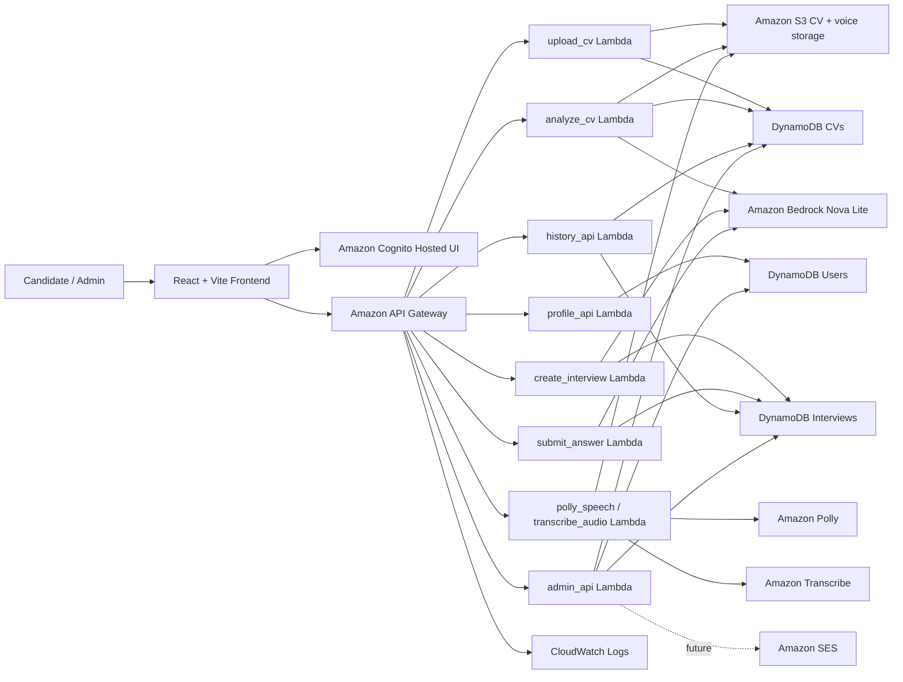

# Đề xuất Vertex-IntervAI 
## Nền tảng phỏng vấn AI trên AWS Serverless

### 1. Tóm tắt dự án

Vertex-IntervAI, là một ứng dụng web hỗ trợ ứng viên luyện phỏng vấn dựa trên chính CV của họ. Người dùng tải CV lên, hệ thống lưu trữ CV an toàn, phân tích nội dung bằng AI, tạo câu hỏi phỏng vấn theo CV và role đã chọn, cho phép trả lời bằng văn bản hoặc giọng nói, chấm điểm từng câu trả lời, sau đó trả về kết quả kèm điểm số, nhận xét và lời khuyên cải thiện.

Dự án sử dụng frontend React + Vite và backend AWS Serverless. Backend được xây dựng bằng Amazon API Gateway, AWS Lambda, Amazon S3, Amazon DynamoDB, Amazon Cognito, Amazon Bedrock, Amazon Polly, Amazon Transcribe, Amazon CloudWatch và Amazon SES cho hướng phát triển gửi email phản hồi.

Hiện tại dự án đã có luồng chính cho người dùng: trang đăng nhập bằng Cognito, dashboard, upload CV, phân tích CV, chọn role phỏng vấn, chọn số câu hỏi, phỏng vấn với AI, chấm điểm câu trả lời, trang kết quả, lịch sử, profile, settings, chuyển đổi ngôn ngữ/giao diện và admin console. Các phần cần hoàn thiện thêm nằm ở xác thực thật bằng JWT, kiểm tra IAM/CORS, test đầy đủ voice flow, đồng bộ history đa thiết bị và triển khai production.

### 2. Bài toán cần giải quyết

Nhiều sinh viên và ứng viên mới đi làm luyện phỏng vấn bằng danh sách câu hỏi chung, nên nội dung luyện tập thường không bám sát CV, kỹ năng, dự án, kinh nghiệm và vị trí ứng tuyển thật. Mock interview thủ công cũng tốn thời gian và khó lặp lại nhiều lần.

Vertex-IntervAI giải quyết bài toán này bằng cách biến CV thành một quy trình luyện phỏng vấn cá nhân hóa:

- Phân tích CV để lấy kỹ năng, kinh nghiệm, học vấn, dự án và gợi ý role phù hợp.
- Cho phép ứng viên chọn role AI như software engineer, data analyst, AI engineer, cloud engineer hoặc role được gợi ý từ CV.
- Tạo số lượng câu hỏi có thể cấu hình, mặc định là 5 và tối thiểu là 2.
- Hỗ trợ trả lời bằng text hoặc voice.
- Chấm điểm từng câu trả lời và đưa ra nhận xét, gợi ý cải thiện.
- Lưu lịch sử phỏng vấn để người dùng xem lại.
- Cung cấp admin console để quản lý users, CVs, interviews, review queue, audit log, export CSV và feedback email.

### 3. Kiến trúc giải pháp

### Dịch vụ AWS sử dụng

- **Amazon S3** lưu CV theo cấu trúc `cv/{userId}/{cvId}.{extension}` và lưu file audio/transcript.
- **Amazon DynamoDB** lưu dữ liệu có cấu trúc trong các bảng `CVs`, `Users` và `Interviews`.
- **AWS Lambda** chạy backend gồm `upload_cv`, `analyze_cv`, `profile_api`, `create_interview`, `submit_answer`, `polly_speech`, `transcribe_audio`, `history_api` và `admin_api`.
- **Amazon API Gateway** cung cấp REST API cho frontend.
- **Amazon Cognito** xử lý đăng nhập thật bằng Hosted UI, JWT token và group `user/admin`.
- **Amazon Bedrock** tạo phân tích CV, câu hỏi phỏng vấn, chấm điểm và feedback bằng Nova Lite kèm fallback.
- **Amazon Polly** tạo audio cho câu hỏi.
- **Amazon Transcribe** chuyển giọng nói của người dùng thành văn bản.
- **Amazon CloudWatch Logs** lưu log backend để debug.
- **Amazon SES** được dùng cho hướng gửi feedback email, cần production access nếu muốn gửi cho email chưa verify.

### 4. Triển khai kỹ thuật

#### Frontend

Frontend nằm trong `frontend/` và dùng React + Vite. Các trang chính gồm:

- Login landing gate với nút đăng nhập Cognito.
- Dashboard hiển thị trạng thái CV, chi tiết CV đã chọn, tóm tắt AI và thao tác nhanh.
- Upload CV có danh sách nhiều CV, xem chi tiết, phân tích và xóa CV.
- AI Interview có chọn role, chọn số câu hỏi, chat box, camera area, voice và điều khiển phỏng vấn.
- Result hiển thị final score, feedback, điểm mạnh, điểm yếu và lời khuyên.
- History có xem chi tiết từng cuộc phỏng vấn.
- Profile có fullname, email, phone và avatar.
- Settings rút gọn với theme, language và question count.
- Admin Console cho tài khoản admin.

Các service frontend gọi API:

- `cvApi.js` gọi upload/analyze CV.
- `interviewApi.js` gọi tạo interview và nộp câu trả lời.
- `voiceApi.js` gọi Polly và Transcribe.
- `profileApi.js` gọi profile.
- `authService.js` đang chuyển từ demo localStorage sang Cognito/JWT.

#### Backend

Backend nằm trong `backend/` và chia theo từng Lambda. Mỗi Lambda đọc environment variables cho tên bảng, tên bucket, cấu hình Bedrock và cấu hình dịch vụ liên quan. Metadata và attempts được lưu trong DynamoDB, còn file lớn như CV/audio/transcript được lưu trong S3.

#### Trạng thái hiện tại

| Hạng mục | Trạng thái |
| --- | --- |
| Upload CV lên S3 | Đã làm |
| Lưu metadata CV vào DynamoDB | Đã làm |
| Phân tích CV bằng Bedrock/fallback | Đã làm |
| Profile GET/POST | Đã làm |
| Tạo câu hỏi phỏng vấn | Đã làm |
| Chấm điểm câu trả lời | Đã làm |
| Polly/Transcribe | Đã có code, cần test thật end-to-end |
| Cognito Hosted UI | Đang cấu hình |
| JWT authorizer và enforce role | Cần kiểm tra lại API Gateway/backend |
| Admin console | Đã có hướng frontend/backend |
| History từ DynamoDB | Đã có hướng, cần test toàn flow |
| CloudFront/WAF | Tạm hoãn vì AWS account chưa verified |
| SES feedback email | Tạm hoãn đến khi có SES production access |

### 5. Timeline và mốc hoàn thành

- **Phase 1 - Core Application**: Xây dựng React pages, demo auth local, upload CV, phân tích CV, tạo interview, chấm điểm và localStorage fallback.
- **Phase 2 - AWS Backend**: Kết nối Lambda, API Gateway, S3, DynamoDB, Bedrock, Polly và Transcribe.
- **Phase 3 - Authentication and Roles**: Cấu hình Cognito User Pool, App Client, Hosted UI, callback/logout URL, group `user/admin`, JWT authorizer và protected routes.
- **Phase 4 - User Experience**: Hoàn thiện dashboard CV switching, upload CV management, AI Interview UI, result, history detail, profile, settings, theme và language switching.
- **Phase 5 - Admin and Operations**: Thêm admin console, admin APIs, audit log, CSV export, review queue, feedback email, IAM least privilege và CloudWatch troubleshooting.
- **Phase 6 - Production Readiness**: Kiểm tra CORS, IAM, Cognito JWT claims, voice flow, history đa thiết bị, CloudFront/WAF khi AWS account verified và SES production access.

### 6. Ước tính chi phí

Dự án được thiết kế cho môi trường đồ án/demo nên chi phí ban đầu thấp nếu lượng người dùng nhỏ. Các phần ảnh hưởng chi phí nhiều nhất là Bedrock inference, Transcribe minutes, Polly characters, S3 storage, DynamoDB read/write capacity, API Gateway requests và Lambda invocations.

Hướng chi phí dự kiến:

- **Demo traffic thấp**: chủ yếu nằm trong free-tier hoặc chi phí thấp, trừ Bedrock/voice usage.
- **Giai đoạn test nhiều**: chi phí tăng theo số lần tạo câu hỏi, chấm điểm, tạo audio và transcribe.
- **Production**: thêm CloudFront, WAF, monitoring, backup và SES production email sau khi account đủ điều kiện.

Cách kiểm soát chi phí:

- Giới hạn số câu hỏi mặc định.
- Chỉ lưu audio/transcript cần thiết.
- Dùng DynamoDB on-demand cho traffic demo khó dự đoán.
- Tạo AWS Budgets alerts.
- Đặt thời gian lưu CloudWatch Logs hợp lý.

### 7. Đánh giá rủi ro

| Rủi ro | Ảnh hưởng | Cách giảm thiểu |
| --- | --- | --- |
| Sai callback/logout URL Cognito | Người dùng không đăng nhập được | Đồng bộ URL trong Cognito và frontend `.env` |
| Thiếu CORS | Frontend không gọi được API | Kiểm tra từng route bằng DevTools và API Gateway CORS |
| IAM thiếu hoặc quá rộng | Lambda lỗi hoặc mất an toàn | Tách policy least privilege cho từng Lambda |
| Bedrock model không sẵn sàng | Không phân tích/chấm điểm được | Giữ fallback và xử lý lỗi rõ ràng |
| Polly voice không hợp tiếng Việt | Audio tiếng Việt đọc sai | Chọn voice theo ngôn ngữ và dùng browser speech fallback khi cần |
| Transcribe sai language code | Nhận diện giọng nói sai | Gửi language code theo ngôn ngữ UI |
| SES sandbox | Chỉ gửi email đến địa chỉ đã verify | Xin SES production access trước khi bật production email |
| CloudFront/WAF bị giới hạn account | Chưa triển khai production static hosting | Dùng local/Vite hoặc S3 hosting trong giai đoạn chờ verified |

### 8. Kết quả kỳ vọng

Sau khi hoàn thiện, dự án sẽ là một nền tảng luyện phỏng vấn AI có cá nhân hóa theo CV, chọn role, tạo câu hỏi, trả lời bằng text/voice, chấm điểm, feedback, result và history. Dự án cũng thể hiện được kiến trúc AWS Serverless thực tế gồm authentication, storage, database, AI services, observability và admin operations.

Về sau, hệ thống có thể mở rộng thành nền tảng talent hoàn chỉnh hơn với analytics, dashboard cho recruiter, team workspace, role taxonomy nâng cao, đa ngôn ngữ tốt hơn và triển khai production bằng S3, CloudFront, WAF và CI/CD.
