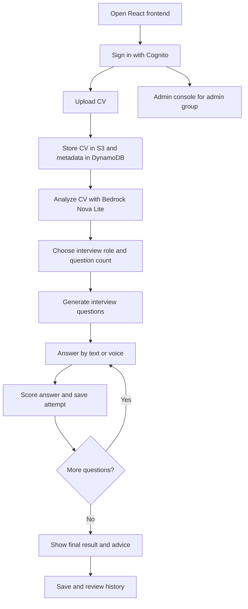

#### Vertex-IntervAI workflow

Vertex-IntervAI is an AI interview preparation system that starts from a candidate CV and ends with a scored interview result. The application has two main personas:

- **Candidate**: uploads CVs, chooses a role, answers AI interview questions, reviews results, and tracks history.
- **Admin**: reviews users, uploaded CVs, interviews, review queues, audit activity, CSV exports, and feedback email workflows.

#### Main AWS components

- **Amazon Cognito** authenticates users and provides JWT tokens.
- **Amazon API Gateway** receives frontend API calls and validates authorization.
- **AWS Lambda** runs the backend business logic.
- **Amazon S3** stores uploaded CV files and voice assets.
- **Amazon DynamoDB** stores user profiles, CV metadata, interview questions, answers, attempts, scores, and history.
- **Amazon Bedrock** powers CV analysis, interview generation, and answer evaluation.
- **Amazon Polly** generates question audio.
- **Amazon Transcribe** converts voice answers to text.
- **Amazon CloudWatch Logs** supports debugging and operations.

#### Workshop goals

By the end of the workshop, you should have:

- S3 buckets/prefixes for CV and voice files.
- DynamoDB tables for `Users`, `CVs`, and `Interviews`.
- Lambda functions configured with environment variables and IAM permissions.
- API Gateway routes for user, interview, voice, history, and admin APIs.
- Cognito User Pool, App Client, Hosted UI, callback/logout URLs, and groups `user/admin`.
- Frontend `.env` values connected to your deployed APIs.
- A tested flow from CV upload to interview result and history detail.
