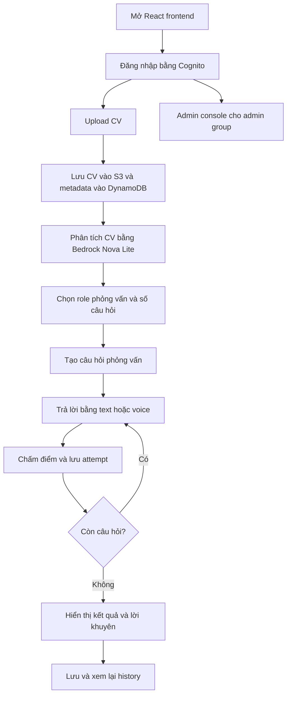

#### Luồng hoạt động Vertex-IntervAI

Vertex-IntervAI là hệ thống luyện phỏng vấn AI bắt đầu từ CV của ứng viên và kết thúc bằng kết quả phỏng vấn có điểm số, feedback và lời khuyên. Ứng dụng có hai nhóm người dùng chính:

- **Candidate**: upload CV, chọn role, trả lời câu hỏi AI, xem kết quả và theo dõi history.
- **Admin**: quản lý users, CVs, interviews, review queue, audit log, export CSV và feedback email.

#### Thành phần AWS chính

- **Amazon Cognito** xác thực người dùng và cấp JWT token.
- **Amazon API Gateway** nhận request từ frontend và kiểm tra authorization.
- **AWS Lambda** chạy business logic backend.
- **Amazon S3** lưu CV đã upload và voice assets.
- **Amazon DynamoDB** lưu profile, metadata CV, câu hỏi, câu trả lời, attempts, điểm và history.
- **Amazon Bedrock** hỗ trợ phân tích CV, tạo câu hỏi và chấm điểm.
- **Amazon Polly** tạo audio câu hỏi.
- **Amazon Transcribe** chuyển câu trả lời bằng giọng nói thành text.
- **Amazon CloudWatch Logs** hỗ trợ debug và vận hành.

#### Mục tiêu workshop

Sau workshop, hệ thống cần có:

- S3 buckets/prefixes cho CV và voice files.
- DynamoDB tables `Users`, `CVs` và `Interviews`.
- Lambda functions có environment variables và IAM permissions đúng.
- API Gateway routes cho user, interview, voice, history và admin APIs.
- Cognito User Pool, App Client, Hosted UI, callback/logout URLs và groups `user/admin`.
- Frontend `.env` trỏ đúng đến các API đã deploy.
- Flow đã test từ upload CV đến interview result và history detail.
